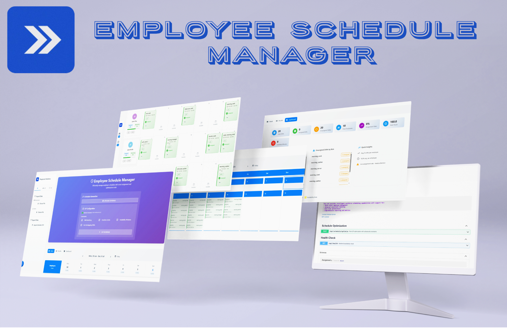

<div align="center">

  <h1>🏢 Time Schedule Manager</h1>
  
  
  
  
  
  
  

  

  <h3>🚀 Advanced Employee Scheduling with Integer Linear Programming (ILP) Optimization</h3>

  


</div>


## :star2: About The Project

An employee scheduling optimization manager that combines modern web technologies with advanced algorithms to solve scheduling problems.


-   **🧮 ILP Optimization**: Utilizes Integer Linear Programming for optimal schedule generation with mathematical guarantees
-   **⚡ Real-time Processing**: Fast offline scheduling algorithms for immediate results without backend dependency
-   **🎨 Modern UI**: Intuitive Angular frontend with responsive design and interactive calendar views
-   **📊 Advanced Analytics**: Comprehensive dashboard with scheduling metrics and employee workload distribution, 
-   **📋 Constraint Management**: Flexible constraint system supporting employee skills, availability, workload limits, and custom business rules
-   **📁 Data Import/Export**: Seamless CSV import for employee and shift data with validation and error handling

```mermaid
  graph TB
    subgraph "Frontend (Angular)"
        UI[🖥️ Angular Application]
        Components[📱 UI Components]
        Services[⚙️ Services Layer]
    end
    
    subgraph "Backend (FastAPI)"
        API[🔗 FastAPI Server]
        Scheduler[📊 Shift Scheduler]
        Optimizer[🧮 ILP Optimizer]
        Constraints[⚡ Constraint Manager]
    end
    
    subgraph "Data Layer"
        Models[📋 Data Models]
        Validation[✅ Data Validation]
    end

    %% Frontend Flow
    UI --> Components
    Components --> Services
    Services -->|HTTP Requests| API
    
    %% Backend Flow
    API --> Scheduler
    Scheduler --> Constraints
    Scheduler --> Optimizer
    Optimizer --> Models
    Models --> Validation
    
    %% Response Flow
    API -->|Optimized Schedule| Services
    Services --> Components
    Components --> UI

    %% Styling
    classDef frontend fill:#e3f2fd,stroke:#1976d2,stroke-width:2px
    classDef backend fill:#e8f5e8,stroke:#388e3c,stroke-width:2px
    classDef data fill:#fff3e0,stroke:#f57c00,stroke-width:2px
    
    class UI,Components,Services frontend
    class API,Scheduler,Optimizer,Constraints backend
    class Models,Validation data
  ````

## 📚 Documentation

### 🖥️ Frontend (Angular Application)
**📂 Location**: [`/frontend`](./frontend)  
**📖 Documentation**: [`Frontend README`](./frontend/README.md)

### ⚙️ Backend (FastAPI Server)
**📂 Location**: [`/backend`](./backend)  
**📖 Documentation**: [`Backend README`](./backend/README.md)

## � Quick Start

### Prerequisites
- **Docker**

### 🏃‍♂️ Running the Application

1. **Clone the repository**
   ```bash
   git clone https://github.com/Andrew-Ayman123/time-schedule-manager
   cd time-schedule-manager
   ```

2. **Docker Deployment**
   ```bash
   docker-compose up --build
   ```

## 📸 Demo


https://github.com/user-attachments/assets/bd483b01-a7c0-4706-a2e3-56394f0c6561


## 🛠️ Technology Stack

| Component | Technologies |
|-----------|-------------|
| **Frontend** | Angular 20, TypeScript, Angular Material |
| **Backend** | FastAPI, Python, Pydantic, Uvicorn, PuLP solver |
| **Development** | Docker, Docker Compose, Node.js, npm |
| **Documentation** | Mermaid Diagrams, Swagger |

## 📄 License

This project is licensed under the MIT License - see the [`LICENSE`](./LICENSE) file for details.
