# Schedule Optimization API Backend

An advanced employee scheduling optimization system built with FastAPI and Integer Linear Programming (ILP) algorithms, designed to solve complex workforce scheduling problems with multiple constraints.

## 📋 Table of Contents

- [🏗️ Diagrams](#️-diagrams)
- [🚀 Quick Start](#-quick-start)
- [📸 Screenshots](#-screenshots)
- [📚 API Usage](#-api-usage)
- [🔧 Available Constraints](#-available-constraints)
- [🧪 Testing](#-testing)
- [📈 Future Enhancements](#-future-enhancements)
- [📝 License](#-license)

## 🏗️ Diagrams

### Architecture Overview


### ILP Optimization Flow Diagram

The core scheduling algorithm uses Integer Linear Programming to find optimal employee-shift assignments:

```mermaid
flowchart TD
    Start([Schedule Request]) --> Validate[Validate Input Data]
    Validate --> CreateProblem[Create ILP Problem]
    CreateProblem --> CreateVars[Create Binary Variables<br/>x_ij in 0 or 1]
    
    CreateVars --> Constraints{Apply Constraints}
    
    Constraints --> SkillMatch[Skill Matching<br/>x_ij = 0 if skill mismatch]
    Constraints --> Overtime[Overtime Limits<br/>Sum duration_j * x_ij ≤ max_hours_i]
    Constraints --> Availability[Availability Windows<br/>x_ij = 0 if outside window]
    Constraints --> NoOverlap[No Overlapping Shifts<br/>Sum x_ij ≤ 1 for overlapping shifts]
    Constraints --> OneAssignment[One Assignment per Shift<br/>Sum x_ij ≤ 1]
    
    SkillMatch --> Objective
    Overtime --> Objective
    Availability --> Objective
    NoOverlap --> Objective
    OneAssignment --> Objective[Set Objective Function<br/>Maximize Sum x_ij]
    
    Objective --> Solver[CBC Solver<br/>Branch & Cut Algorithm]
    Solver --> Optimal{Optimal Solution?}
    
    Optimal -->|Yes| ExtractSolution[Extract Assignments<br/>where x_ij = 1]
    Optimal -->|No| Infeasible[Return Infeasible Status]
    
    ExtractSolution --> Metrics[Calculate Metrics<br/>• Objective Value<br/>• Overtime Hours<br/>• Execution Time]
    Infeasible --> ErrorResponse[Error Response]
    
    Metrics --> Response[Schedule Response<br/>• Assignments<br/>• Unassigned Shifts<br/>• Optimization Metrics]
    
    Response --> End([Return Results])
    ErrorResponse --> End
    
    style Start fill:#e1f5fe
    style End fill:#c8e6c9
    style Solver fill:#fff3e0
    style Optimal fill:#fce4ec
    style ErrorResponse fill:#ffebee
```



### API Sequence Diagram

This diagram shows the complete request-response flow for schedule optimization:


## 🚀 Quick Start

### Prerequisites

- Python 3.10 or higher

### Local Development Setup

1. **Clone the repository**
   ```bash
   git clone "https://github.com/Andrew-Ayman123/time-schedule-manager"
   cd time-schedule-manager/backend
   ```

2. **Create virtual environment**
   ```bash
   python -m venv venv
   source venv/bin/activate  # On Windows: venv\Scripts\activate
   ```

3. **Install dependencies**
   ```bash
   pip install -r requirements.txt
   ```

4. **Run the application**
   ```bash
   cd app
   python -m uvicorn main:app --host 0.0.0.0 --port 8000 --reload
   ```

5. **Access the API**
   - API Documentation: http://localhost:8000/api/docs
   - Alternative Docs: http://localhost:8000/api/redoc
   - Health Check: http://localhost:8000/api/health

## 📸 Screenshots

### API Documentation Interface
*Interactive API documentation powered by Redoc UI*


*Interactive API documentation powered by Swagger UI*


### Schedule Optimization Request
*Example of a schedule optimization request*


*Successful optimization response showing assignments and metrics*


### Pytest Terminal Output


## 📚 API Usage

### Schedule Optimization Endpoint

**POST** `/api/schedule/optimize`

Optimizes employee-shift assignments using ILP algorithms.

#### Request Body

```json
{
  "employees": [
    {
      "id": "E1",
      "name": "John Doe",
      "skills": ["frontend", "backend"],
      "max_hours": 40,
      "availability": {
        "start": "2024-01-15T09:00:00",
        "end": "2024-01-15T17:00:00"
      }
    }
  ],
  "shifts": [
    {
      "id": "S1",
      "name": "Morning Frontend",
      "start_time": "2024-01-15T09:00:00",
      "end_time": "2024-01-15T13:00:00",
      "duration_hours": 4,
      "required_skill": "frontend"
    }
  ],
  "constraints": [
    "skill_matching",
    "overtime_limits",
    "availability_windows",
    "no_overlapping"
  ],
  "current_assignments": []
}
```

#### Response

```json
{
  "success": true,
  "assignments": [
    {
      "shift_id": "S1",
      "employee_id": "E1"
    }
  ],
  "unassigned_shifts": [],
  "metrics": {
    "total_overtime_minutes": 0,
    "constraint_violations": 0,
    "optimization_time_ms": 45,
    "objective_value": 1.0
  },
  "constraints_applied": [
    "skill_matching",
    "overtime_limits",
    "availability_windows",
    "no_overlapping"
  ],
  "message": "Optimization completed successfully"
}
```

## 🔧 Available Constraints

| Constraint Type | Description |
|----------------|-------------|
| `skill_matching` | Ensures employees are only assigned to shifts requiring skills they possess |
| `overtime_limits` | Prevents employees from exceeding their maximum allowed hours |
| `availability_windows` | Restricts assignments to employee availability time windows |
| `no_overlapping` | Prevents employees from being assigned to overlapping shifts |

## 🧪 Testing

### Run All Tests
```bash
pytest
```

## 📈 Future Enhancements

- [ ] Multi-objective optimization (higher number of shifts assigned vs. lower overtime minutes)
- [ ] Add support for additional scheduling constraints:
  - [ ] Minimum rest time between shifts (e.g., 8 hours between consecutive shifts)
  - [ ] Maximum consecutive working days limits
  - [ ] Preferred shift assignments based on employee preferences
  - [ ] Holiday and vacation time constraints
  - [ ] Shift pattern constraints (e.g., no night shift after day shift)
- [ ] Add support for backend database to save employee data and return to the user
- [ ] Add support for automated email send to employees with the ir schedule for the week
- [ ] Advanced metrics reporting like cpu utilization or any other needed
- [ ] Integration with external HR systems 

## 📝 License

This project is licensed under the MIT License - see the LICENSE file for details.