# Schedule Optimization Frontend


Angular application that schedule employees through optimization algorithms (Offline and online though backend ILP), featuring real-time data visualization, constraint-aware assignment algorithms, and seamless backend integration for optimal resource allocation.

## 📋 Table of Contents

- [🏗️ Architecture](#️-architecture)
- [🔄 Sequence Diagrams](#-sequence-diagrams)
- [🚀 Getting Started](#-getting-started)
- [📸 Screenshots](#-screenshots)
- [📈 Future Work](#-future-work)
- [📝 License](#-license)


## 🏗️ Architecture

### System Architecture  Architecture

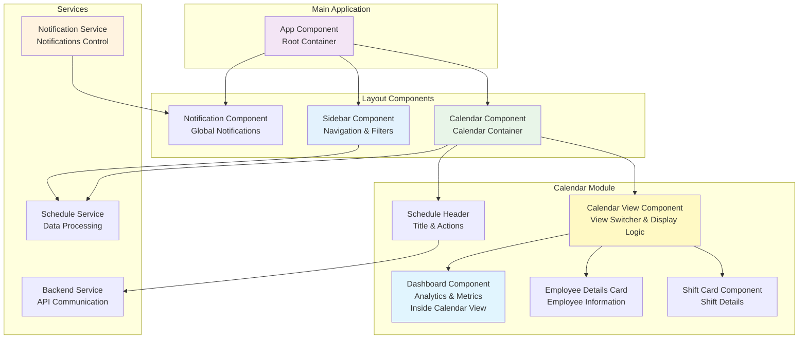

## 🔄 Sequence Diagrams

### Schedule Generation Flow

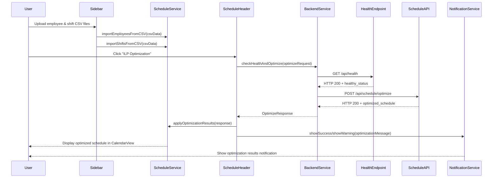

### Offline Schedule Generation Flow

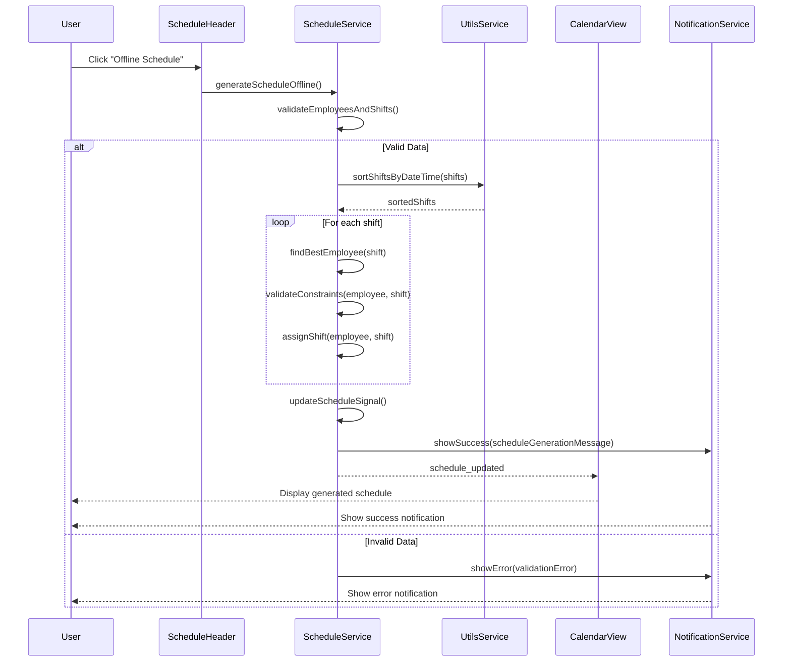
## 🚀 Getting Started

### Prerequisites

Ensure you have the following installed:

- **Node.js** (v18.0 or higher) - [Download here](https://nodejs.org/)
- **npm** (v9.0 or higher) - Comes with Node.js
- **Angular CLI** (v20.0 or higher)

```bash
npm install -g @angular/cli
```

### Installation & Setup

1. **Clone the repository**
   ```bash
   git clone https://github.com/Andrew-Ayman123/time-schedule-manager
   cd time-schedule-manager/frontend
   ```

2. **Install dependencies**
   ```bash
   npm install
   ```

3. **Verify Angular CLI version**
   ```bash
   ng version
   ```

5. **Start the development server**
   ```bash
   ng serve --host "0.0.0.0" --port 3000
   ```

6. **Access the application**
   Open your browser and navigate to `http://localhost:3000/`


### Sample Data

Use the provided sample CSV files to test the application:

- **Easy**: Simple 10-employee, 20-shift scenario
- **Medium**: Moderate complexity with 40 employees, 120 shifts
- **Complex**: Advanced scenario with 50 employees, 200 shifts

## 📸 Screenshots

### 1. Initial Application Page
*The landing page of the Schedule Optimization Frontend showing the clean, modern interface with navigation and welcome screen.*

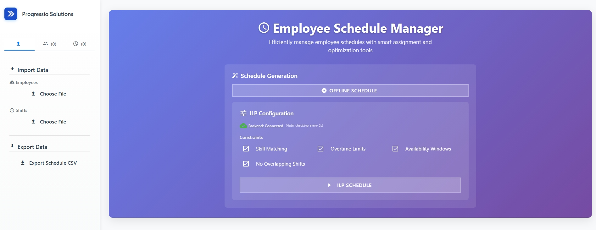

### 2. Data Ingestion Interface
*The data upload interface where users can import employee and shift data via CSV files.*

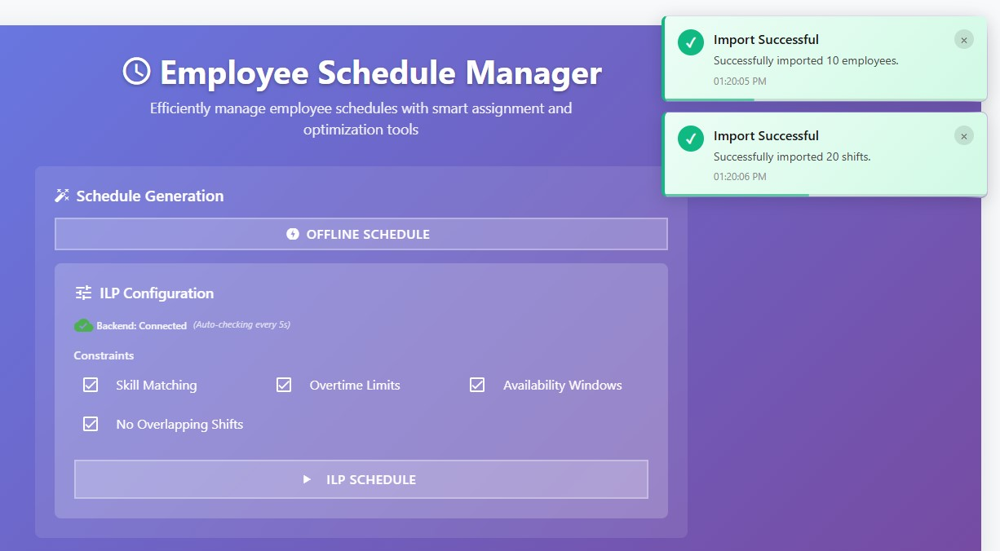

### 3. Employee Management Sidebar
*The sidebar showing imported employee data with their details, skills, and availability information.*

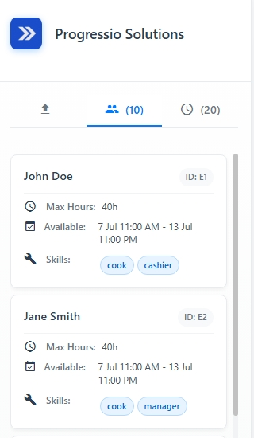

### 4. Shift Management Sidebar
*The sidebar displaying imported shift data with shift details, requirements, and time slots.*

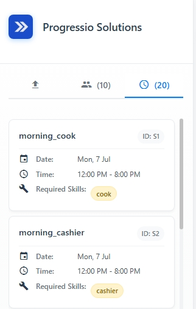

### 5. Unassigned Schedule - Week View
*Weekly calendar view showing unassigned shifts before optimization, highlighting scheduling gaps.*

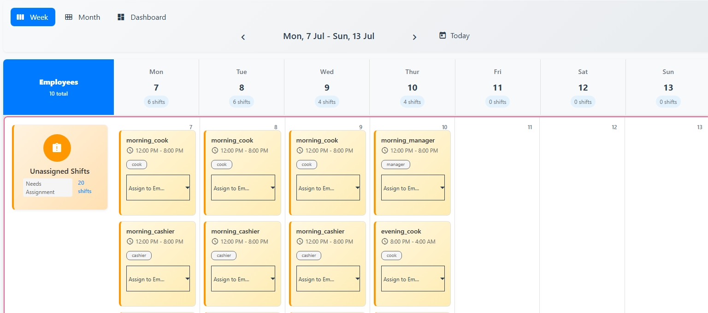

### 6. Unassigned Schedule - Month View
*Monthly calendar view displaying unassigned shifts across the entire month before schedule generation.*

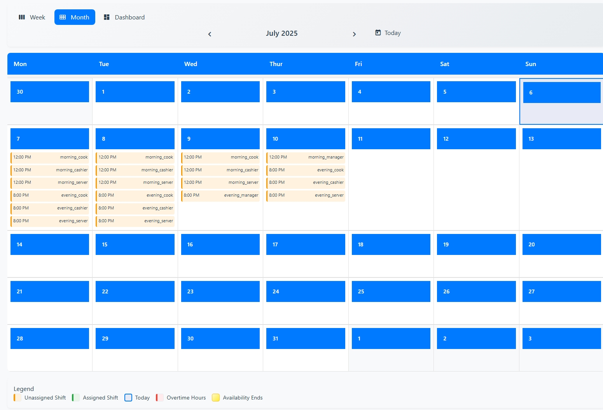

### 7. Unassigned Schedule - Dashboard View
*Dashboard analytics showing statistics and metrics for unassigned shifts and employee availability.*

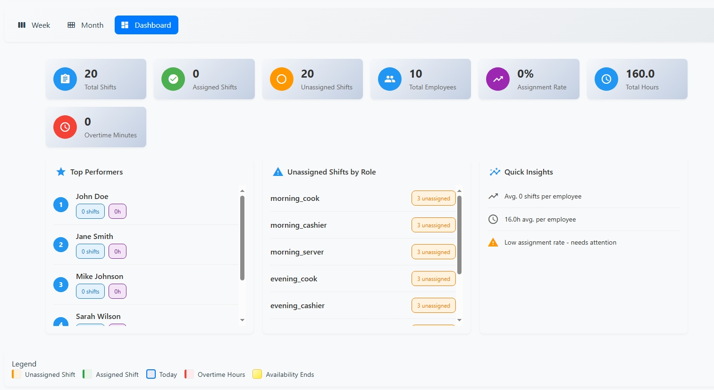

### 8. Offline Schedule Generation
*The offline scheduling process in action, showing the local algorithm generating optimal assignments.*

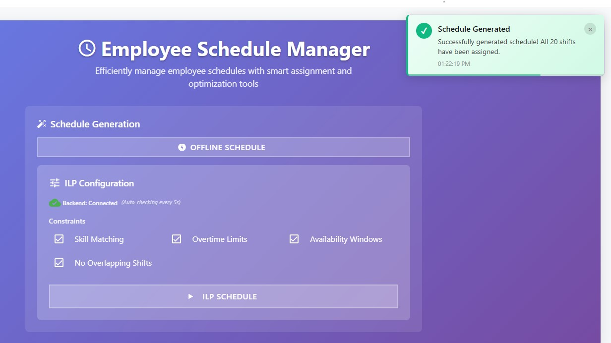

### 9. Assigned Schedule - Week View
*Weekly view after successful schedule optimization, showing assigned employees to their respective shifts.*

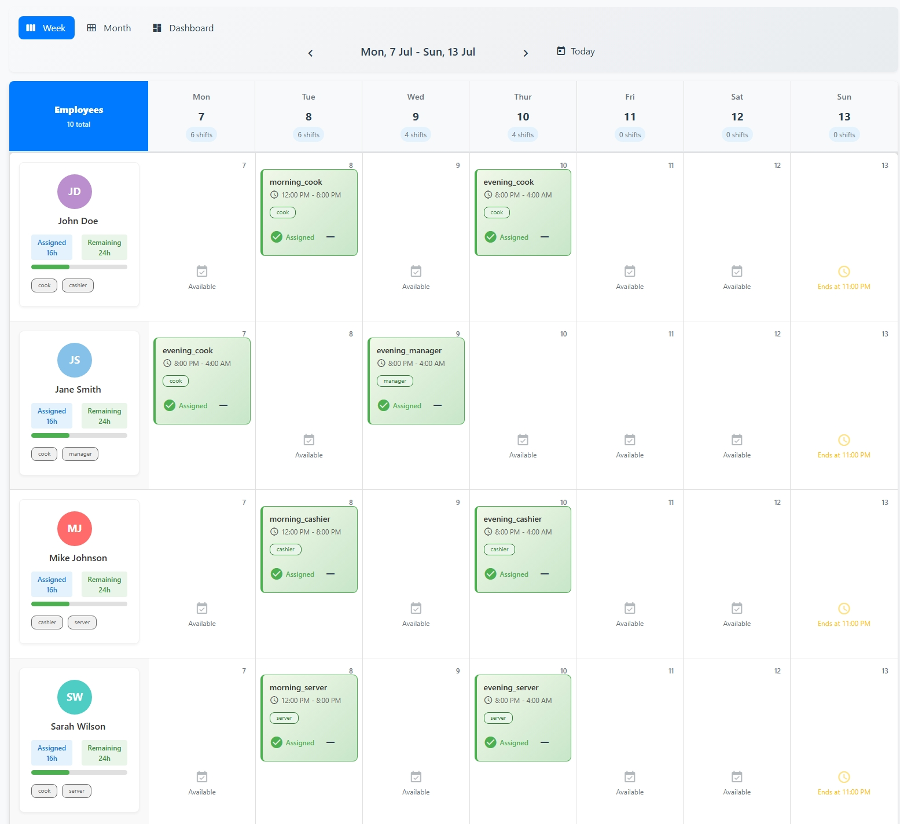

### 10. Assigned Schedule - Month View
*Monthly calendar view displaying the complete optimized schedule with all assignments across the month.*

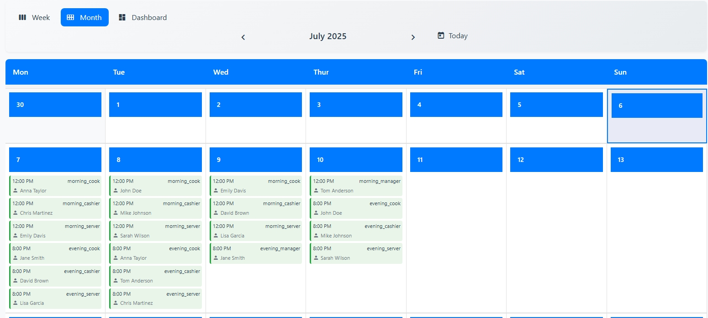

### 11. Assigned Schedule - Dashboard View
*Analytics dashboard showing optimization results, assignment statistics, and performance metrics.*

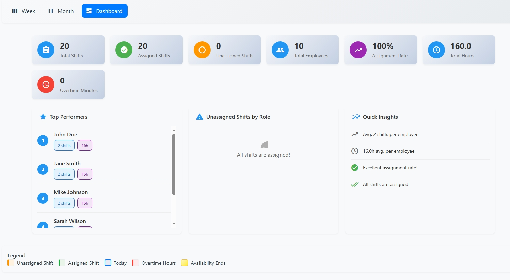

### 12. Online Optimization Output
*Results from the ILP (Integer Linear Programming) backend optimization showing detailed optimization metrics.*

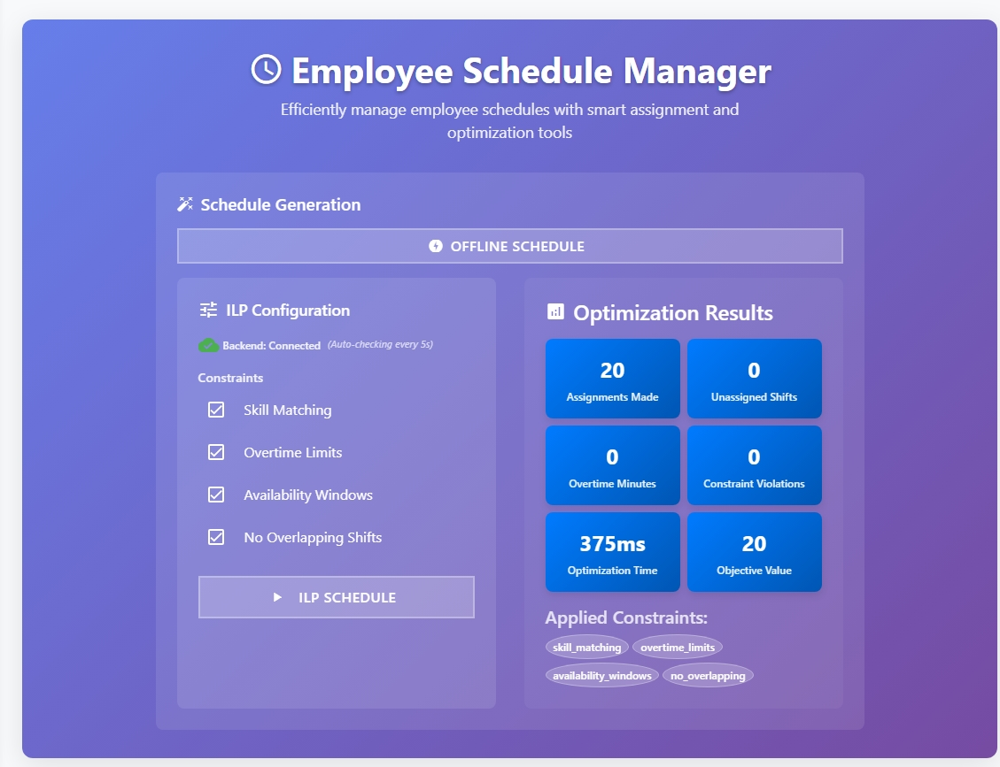

### 13. Optimization Request Output
*Detailed request and response data from the backend optimization API, showing the optimization process flow.*

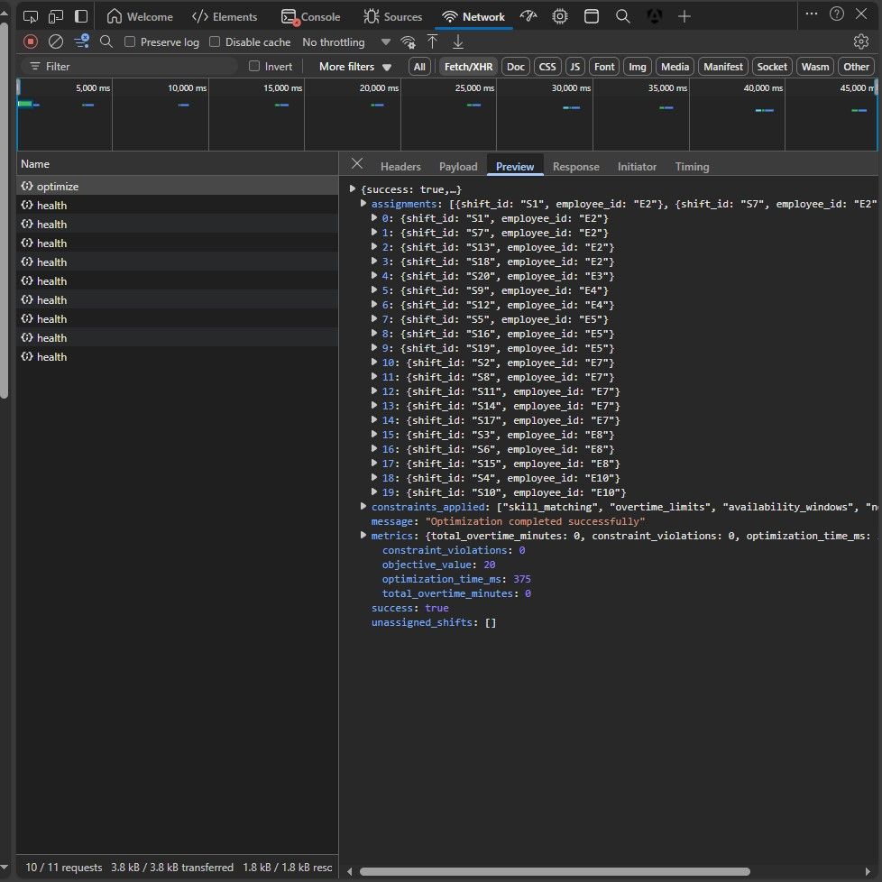


## 📈 Future Work

- [ ] **Real-time Collaboration Features**
  - [ ] WebSocket integration for live schedule updates
  - [ ] Multi-user editing with conflict resolution
  - [ ] Real-time notifications for schedule changes

- [ ] **Advanced UI/UX Improvements**
  - [ ] Dark mode theme support with user preference persistence
  - [ ] Drag-and-drop for data import

- [ ] **Enhanced Data Visualization & Analytics**
  - [ ] Advanced analytics dashboard with Chart.js integration
  - [ ] Employee workload distribution charts and heatmaps

- [ ] **Performance & Scalability**
  - [ ] Advanced caching strategies
  - [ ] Lazy loading of components and modules
  - [ ] State management optimization

## 📝 License
This project is licensed under the MIT License - see the LICENSE file for details.